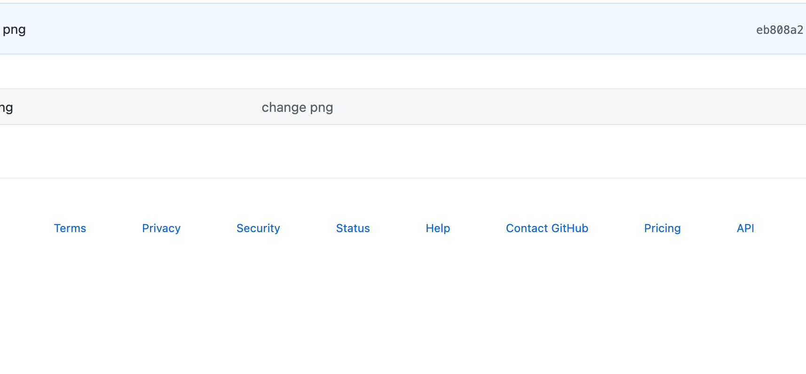
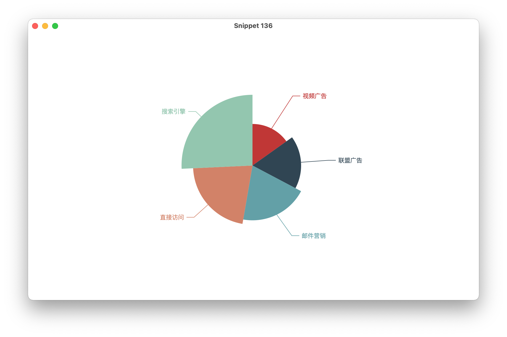
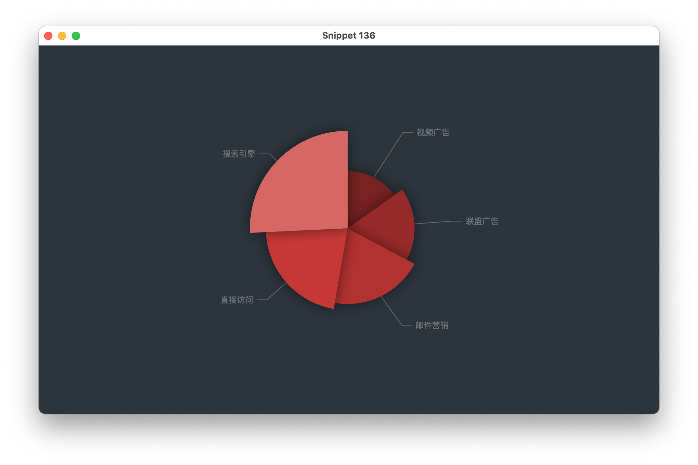

# jechart
echart for java

## Snapshot
### Pie Chart
[SnippetPie01](src/main/java/org/dusg/jechart/snapshot/SnippetPie01.java)

[SnippetPie02](src/main/java/org/dusg/jechart/snapshot/SnippetPie02.java)

[SnippetPie03](src/main/java/org/dusg/jechart/snapshot/SnippetPie03.java)

